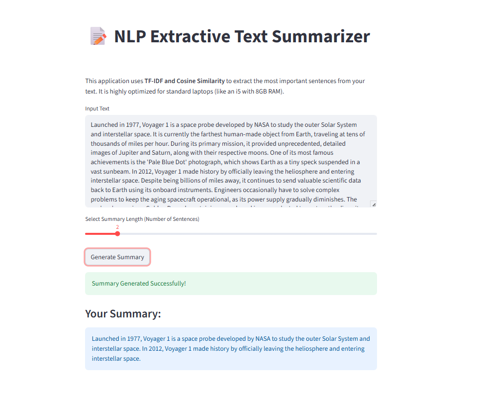

# 📝 End-to-End NLP Text Summarizer (Extractive)

## 📌 Project Overview
This is an end-to-end Natural Language Processing (NLP) project that performs **extractive text summarization**. It takes long news articles and mathematically condenses them into short, meaningful summaries by identifying the most important sentences. 

*Note: This architecture was specifically designed to be highly resource-efficient, running smoothly on standard hardware without the massive memory overhead of deep learning models.*

## 🛠️ Tech Stack & Methodologies
* **Language:** Python
* **NLP Techniques:** Tokenization, Stopword removal, TF-IDF Vectorization, Cosine Similarity.
* **Libraries:** NLTK, Scikit-learn, Pandas, NumPy, Rouge.
* **Web Framework:** Streamlit.

## 📸 App Demonstration

## 🧠 How It Works
1. **Preprocessing:** The text is cleaned, tokenized, and stopwords are removed.
2. **Vectorization:** Sentences are converted into numerical vectors using **TF-IDF** (Term Frequency-Inverse Document Frequency).
3. **Similarity Matrix:** The algorithm calculates the **Cosine Similarity** between all sentence vectors to find the most central and relevant sentences.
4. **Extraction:** The top-ranked sentences are extracted and reordered to form the final summary.
